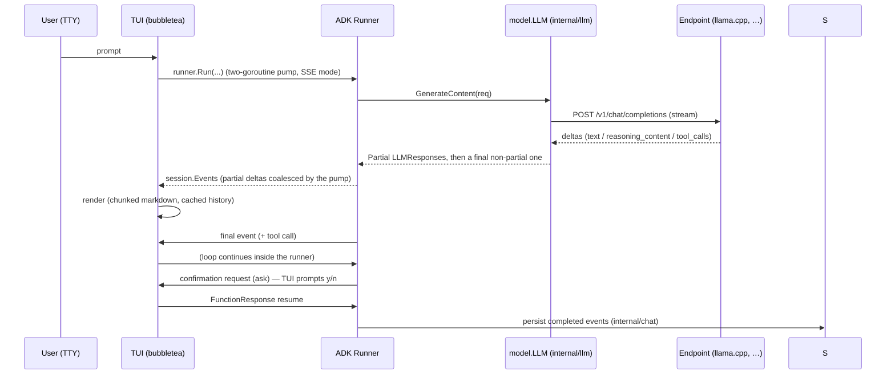

# Architecture

`garess` is a thin, opinionated shell around the Google Agent Development Kit
(ADK, `google.golang.org/adk/v2`). The ADK runner owns the agent loop (model →
tool call → execute → feed back); garess supplies the model transport, the
session store, the tools, the hooks, and the terminal UI.

Read this with the per-package `AGENTS.md` files open — they hold the
conventions and gotchas that caused real bugs. This document is the map.

## The shape of a turn

## Startup order matters

`cmd/garess` (`runTUI`) builds everything in dependency order, and the last
step is deliberately the sandbox:

1. Load + validate config (typed errors → friendly messages).
2. Create the directories garess needs (global config dir, memory dirs).
3. Build the memory store, session service (JSONL), and a shared preamble
   holder (AGENTS.md/SYSTEM.md + skills text).
4. Build one ADK harness provider per config provider (`harness.Build`):
   custom `model.LLM`, built-in functiontools, `llmagent` with the preamble,
   policy deny callback, iteration cap, hooks plugin.
5. **Apply the sandbox** (`sandbox.Apply`) — whole-process and irreversible,
   so it runs after every directory exists and before the first user turn.
6. Start the TUI.

The TUI never writes to the session service directly. It pumps ADK
`session.Event`s and renders them; the runner persists completed events.

## Package map

| Package            | Responsibility                                      | Depends on                                   |
| ------------------ | --------------------------------------------------- | -------------------------------------------- |
| `cmd/garess`       | CLI, flags, `doctor`, startup wiring                | everything                                   |
| `internal/config`  | TOML config, XDG paths, merge, typed errors         | —                                            |
| `internal/agents`  | AGENTS.md/SYSTEM.md discovery + rendering           | —                                            |
| `internal/skills`  | skill discovery + rendering                         | `internal/agents`                            |
| `internal/memory`  | markdown memory notes (local + global)              | —                                            |
| `internal/llm`     | custom ADK `model.LLM` over OpenAI chat-completions | —                                            |
| `internal/chat`    | ADK `session.Service` over JSONL transcripts        | —                                            |
| `internal/tools`   | built-in functiontools + allow/ask/deny policy      | `internal/memory`                            |
| `internal/hooks`   | git-style shell hooks as an ADK plugin              | `internal/config`                            |
| `internal/sandbox` | Landlock write sandbox (`none`/`auto`/`landlock`)   | `internal/config`                            |
| `internal/harness` | wires one provider into ADK agent + runner          | config, hooks, llm, memory, tools            |
| `internal/tui`     | Bubble Tea UI; pumps runner events                  | agents, chat, harness, memory, skills, tools |

## Key design decisions

**ADK drives the loop.** The runner implements model → tool → feedback with
native OpenAI function calling (no text `<tool_call>` protocol) and HITL
confirmations via `toolconfirmation`. garess does not reimplement an agent
loop.

**The model is a hand-rolled `model.LLM`** (`internal/llm`). No OpenAI SDK on
the wire: the chat-completions request/response is built directly so
`reasoning_content` (thinking) stays under our control and maps to
`genai.Part{Thought: true}`. System instructions arrive via
`req.Config.SystemInstruction`; tool calls/responses map to native
`tool_calls[]` / `tool` role messages. Thinking is never sent back to the
model.

**Sessions are JSONL files** (`internal/chat`), implementing ADK's
`session.Service` (Create/Get/List/Delete/AppendEvent) with one
`session.Event` per line plus a `.meta.json` sidecar. The service trims to
`history_limit` on read; **Partial events are never persisted**. It passes
ADK's conformance suite.

**Hooks are an ADK plugin** (`internal/hooks`). Only callbacks for configured
events are registered (zero overhead otherwise). Blocking (`before_*`) hooks
abort by returning an error; notifications only `slog.Warn`. Hook timeouts
kill the whole `sh` process group (see the package AGENTS.md for the dash
fork gotcha). `after_model`/`on_event` fire only on non-partial responses.

**The sandbox is write confinement, not containment** (`internal/sandbox`).
Raw `x/sys/unix` Landlock syscalls (no cgo); process-wide via
`landlock_restrict_self(TSYNC)` (ABI ≥ 6). Reads and execution are never
handled, so they stay allowed everywhere. `landlock` fails closed; `auto`
degrades to `none`. On the Pi 1 (armv6 kernels ship without Landlock) only
the fallback path exists.

**The TUI is engineered for a 700 MHz ARM11.** Three ideas carry the
performance story, each documented as a hard-won rule in
`internal/tui/AGENTS.md`:

1. _Coalescing_: streamed deltas are batched on a fixed cadence so Bubble Tea
   does ~20 renders/second during streaming, not one per token.
2. _Incremental rendering_: completed events and finalized markdown chunks are
   rendered once and cached; only a small live tail is re-rendered per frame.
   `renderAll()` (full re-glamour) is reserved for resize, `/new`, and
   `ctrl+t`.
3. _No per-frame lipgloss on big blocks_: `View()` joins strings instead of
   `lipgloss.JoinVertical`, and the conversation viewer (`convView`) pads with
   plain newlines instead of a `Height` style — both were O(frame) lipgloss
   passes that dominated per-keystroke latency on the Pi.

**Bubble Tea v1, not v2.** The whole Charm stack is pinned to v1 (bubbletea
v1.3.10, bubbles v1.0.0, lipgloss v1.1.0, glamour v1.0.0) because `bubbles`
only exists on the v1 API. This is a deliberate, documented constraint.

## Data and file layout at runtime

| Path                                      | Contents                                   |
| ----------------------------------------- | ------------------------------------------ |
| `~/.config/garess/config.toml`            | global config                              |
| `~/.config/garess/memory/`                | global memory notes (`<name>.md`)          |
| `~/.config/garess/garess.log`             | structured logs (TUI owns stdout)          |
| `.garess/config.toml`                     | project config overlay                     |
| `.garess/memory/`                         | project memory notes                       |
| `.garess/sessions/<id>.jsonl`             | session transcript (one event per line)    |
| `.garess/sessions/<id>.meta.json`         | session metadata                           |
| `<launchdir>/AGENTS.md`, `SYSTEM.md`      | project instruction files (injected)       |
| `skills/<name>/SKILL.md` (or `README.md`) | skill packs (user, project, or launch dir) |

## Testing strategy

- **Deterministic TUI tests** drive Bubble Tea with a blocking input reader
  and `prog.Send(...)`, asserting on the returned model value.
- **No real networks in tests**: the LLM client and the harness run against
  `httptest` fake OpenAI endpoints streaming canned SSE chunks.
- **Hooks and the tool loop** are exercised end-to-end through the harness
  with real `sh` and a fake model.
- **The sandbox** is exercised in a helper subprocess (`GARESS_SANDBOX_HELPER`)
  because `Apply` is irreversible in-process; it is skipped when the kernel
  ABI < 6. ABI detection is a package variable so tests can simulate
  Landlock-less kernels.
- Cross-compiled test binaries (`go test -c`) run on the Pi for on-device
  validation — see [Development](development.md).

## Where to look next

- Per-package `AGENTS.md` files — the authoritative conventions for each
  folder (`internal/tui/AGENTS.md` is the longest; the performance rules
  there each caused a real bug).
- [Development](development.md) — build targets, cross-compilation, and
  profiling tools.
