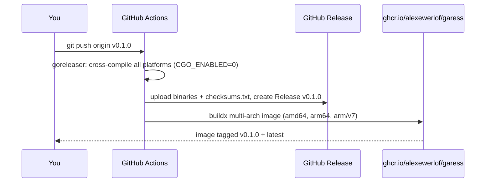

# Releasing

How to cut a new `garess` release. This page is for the maintainer — the
whole pipeline is driven by pushing a `v*` git tag; everything else happens
in CI.

## How it works

Pushing a semver tag (`v0.1.0`, `v0.1.1`, …) triggers
`.github/workflows/release.yml`:



- **Binaries** are raw single files named `garess-<os>-<arch>`
  (e.g. `garess-linux-armv6`), plus a `checksums.txt`. Config lives in
  [`.goreleaser.yml`](../.goreleaser.yml).
- **Container image** `ghcr.io/alexewerlof/garess` (Linux amd64/arm64/armv7).
  The Raspberry Pi 1 is served by the raw `garess-linux-armv6` binary, not
  the image — there is no practical Docker on a Pi 1.
- The version is stamped into every artifact (`garess --version` reports the
  tag). See the versioning note below.

## Before you release

- `make fmt` clean, `go vet ./...` and `go test ./...` pass.
- `garess doctor` output is sensible (config + endpoint + sandbox).
- User-visible changes are reflected in the docs and
  `internal/config/example-config.toml` — the bundled `garess init` template
  (embedded via `config.Example()`; releases ship binaries only, no extra
  files).
- The tag must be new — a release for an existing tag is re-runnable but will
  fail/overwrite semantics; cut a new patch version instead (`v0.1.1`).

## Cut a release

```sh
# 1. Pre-flight
cd /code/learn/garess
make fmt && go vet ./... && go test ./...

# 2. Tag and push (this is the whole deploy)
git tag -a v0.1.0 -m "garess v0.1.0"
git push origin v0.1.0

# 3. Watch CI (two jobs: "Build binaries + GitHub Release", then "Build +
#    push GHCR image")
gh run watch
```

## What you should see

The GitHub Release at
`https://github.com/alexewerlof/garess/releases/tag/v0.1.0` (or
`gh release view v0.1.0`) with these assets:

| Asset                      | Platform                                       |
| -------------------------- | ---------------------------------------------- |
| `garess-linux-amd64`       | Linux x86-64 (most desktops/servers)           |
| `garess-linux-arm64`       | Linux ARM64 (Pi 4/5 on 64-bit OS, ARM servers) |
| `garess-linux-armv6`       | **Raspberry Pi 1 / Zero**                      |
| `garess-darwin-amd64`      | macOS (Intel)                                  |
| `garess-darwin-arm64`      | macOS (Apple Silicon)                          |
| `garess-windows-amd64.exe` | Windows (experimental — needs a TTY)           |
| `garess-windows-arm64.exe` | Windows on ARM64 (experimental — needs a TTY)  |
| `garess-freebsd-amd64`     | FreeBSD amd64                                  |
| `garess-freebsd-arm64`     | FreeBSD arm64                                  |
| `checksums.txt`            | sha256 of every asset                          |

And in GHCR (`docker buildx imagetools inspect
ghcr.io/alexewerlof/garess:v0.1.0`): a multi-arch image (linux/amd64,
linux/arm64, linux/arm/v7) tagged `v0.1.0`, `0.1.0`, `0.1` and `latest`.

## Verify a release

```sh
# Release page + assets exist
gh release view v0.1.0

# Checksums check out (download any asset and verify)
curl -sL -o /tmp/garess https://github.com/alexewerlof/garess/releases/download/v0.1.0/garess-linux-amd64
curl -sL -o /tmp/checksums.txt https://github.com/alexewerlof/garess/releases/download/v0.1.0/checksums.txt
(cd /tmp && sha256sum -c checksums.txt --ignore-missing)
/tmp/garess --version        # -> garess v0.1.0

# Image pulls and runs
docker run --rm ghcr.io/alexewerlof/garess:v0.1.0 --version
```

### Pi 1 smoke test (armv6)

Remember the deploy rules learned in on-device validation: verify by checksum,
never `scp` over a running binary (`ETXTBSY`) — copy to `/tmp` then `mv` (a
running process keeps its old inode), and never kill the live TUI on the Pi.

```sh
# From the host
curl -sL -o /tmp/g6 https://github.com/alexewerlof/garess/releases/download/v0.1.0/garess-linux-armv6
md5sum /tmp/g6
scp /tmp/g6 user@rpi1:/tmp/garess-new
ssh user@rpi1 'mv /tmp/garess-new ~/garess && md5sum ~/garess && ~/garess --version && ~/garess doctor'
```

## Fixing a bad release

- **Assets/release notes only**: edit the release on GitHub or
  `gh release edit v0.1.0 --notes "…"` — no new tag needed.
- **Broken binary**: cut a patch release (`v0.1.1`); never force-push a tag.
- **Remove a release entirely** (e.g. accidentally published secrets):
  `gh release delete v0.1.0 --cleanup-tag` — this also removes the tag and the
  GHCR image remains; delete image tags in the GHCR UI if needed.

## Manual fallback (CI is down)

Releases are built to be push-button, but everything can be done locally:

```sh
# Binaries + GitHub Release (needs a GITHUB_TOKEN with repo write access)
GITHUB_TOKEN=<token> goreleaser release --clean

# ...or without goreleaser at all:
make VERSION=v0.1.0 build-all
gh release create v0.1.0 dist/* --title "garess v0.1.0" --notes "…"

# Container image (needs docker buildx + `docker login ghcr.io`)
docker buildx build --push \
  --platform linux/amd64,linux/arm64,linux/arm/v7 \
  -t ghcr.io/alexewerlof/garess:v0.1.0 \
  -t ghcr.io/alexewerlof/garess:latest \
  --build-arg VERSION=v0.1.0 .
```

## Versioning

- Semantic versions: `vMAJOR.MINOR.PATCH`, tags prefixed with `v`.
- `garess --version` prints the build tag for release artifacts and `dev` for
  local builds.
- The stamp is `-ldflags "-X main.version=<tag>"`. Note **`main.version`**, not
  the full import path: the Go compiler names symbols in the `main` package
  `main.<name>` regardless of its directory, and `-X` against the full path
  silently does nothing. The Makefile (`LDFLAGS`), `.goreleaser.yml` and the
  `Dockerfile` all use the same symbol — keep them in sync.
- Release assets are raw binaries, not tarballs, so a download is a single
  `chmod +x`. If that ever changes, update the asset table above and the
  install snippets in the [README](../README.md) and
  [getting-started](getting-started.md).
